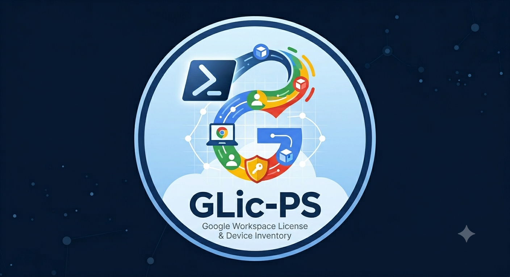

<p align="center">
  
</p>

<h1 align="center">GLic-PS</h1>
<p align="center"><strong>Google Workspace License &amp; Device Inventory — pure PowerShell, no modules required</strong></p>

---

GLic-PS exports Google Workspace license assignments, Chromebook inventory, hardware telemetry, users, apps, managed browser profiles, and Chrome extensions to CSV — all from a drop-in folder of PowerShell scripts. There is no module to install, no NuGet packages, and no build step. Drop the folder on a machine running Windows PowerShell 5.1, point a scheduled task at the runner you want, and walk away.

---

## Table of Contents

- [Table of Contents](#table-of-contents)
- [Google Workspace — Licenses and Chromebook Management](#google-workspace--licenses-and-chromebook-management)
  - [Licensing](#licensing)
  - [Chromebook (Chrome OS Device) Management](#chromebook-chrome-os-device-management)
- [How Authentication Works](#how-authentication-works)
- [Prerequisites](#prerequisites)
- [Setup Guide](#setup-guide)
  - [Step 1 — Create a Google Cloud Project](#step-1--create-a-google-cloud-project)
  - [Step 2 — Create a Service Account](#step-2--create-a-service-account)
  - [Step 3 — Enable Domain-Wide Delegation (DWD)](#step-3--enable-domain-wide-delegation-dwd)
  - [Step 4 — Find Your Customer ID](#step-4--find-your-customer-id)
- [Deployment](#deployment)
  - [glic.json](#glicjson)
  - [SKU Discovery (Recommended)](#sku-discovery-recommended)
- [IT Asset Management Collection Tool Setup](#it-asset-management-collection-tool-setup)
  - [Recommended Deployment Path](#recommended-deployment-path)
  - [Execution Policy](#execution-policy)
  - [Scheduling with Windows Task Scheduler](#scheduling-with-windows-task-scheduler)
  - [Pointing Your ITAM Tool at the Output](#pointing-your-itam-tool-at-the-output)
- [Runner Scripts](#runner-scripts)
- [Cmdlet Reference](#cmdlet-reference)
- [Output Field Reference](#output-field-reference)
- [Repository Structure](#repository-structure)
- [License](#license)

---

## Google Workspace — Licenses and Chromebook Management

### Licensing

Every user account in a Google Workspace tenant consumes a license SKU. SKUs map to the edition a user is assigned: Business Starter, Business Standard, Education Plus, and so on. Admins assign licenses individually or automatically by organizational unit. The **Apps Licensing API** exposes per-user assignment records, which GLic-PS uses to build a full license roster enriched with user directory attributes.

### Chromebook (Chrome OS Device) Management

Google Workspace tenants can enroll Chrome OS devices into the **Admin Console**. Once enrolled, every device is tied to the tenant's customer ID and appears in the **Directory API** with full inventory metadata — serial number, model, OS version, last-sync timestamp, enrolled user, org unit, MAC addresses, and more.

The **Chrome Management Telemetry API** layers hardware observability on top of the directory record: CPU model and architecture, RAM, storage, battery health, GPU, and OS update state. GLic-PS joins these two data sources by `deviceId` to produce a single enriched row per device.

The **Chrome Management Reports API** provides fleet-wide app and extension usage counts across all enrolled devices and managed browsers.

---

## How Authentication Works

GLic-PS uses **Domain-Wide Delegation (DWD)** — a Google OAuth 2.0 pattern where a service account is authorized to impersonate an admin user and call Workspace APIs on behalf of your domain. No user interaction or browser login is required, making it fully automation-friendly.

`Get-GlicAccessToken` in `GLic-Runtime.ps1` implements the full flow without any external packages:

1. Builds a JWT header and payload (RS256, impersonating `admin_email`).
2. Signs the JWT using `System.Security.Cryptography.RSACng` — available in .NET 4.7.2+ without any NuGet dependency.
3. POSTs the signed JWT to `https://oauth2.googleapis.com/token` and exchanges it for a bearer token.
4. Caches the token in session scope for 55 minutes, re-requesting 2 minutes before expiry.

The service account key (`service-account.json`) and the admin email to impersonate (`admin_email` in `glic.json`) are the only credentials required on the collection machine.

---

## Prerequisites

| Requirement | Notes |
|---|---|
| Windows PowerShell 5.1 | Ships with Windows 10/11 and Windows Server 2016+ |
| .NET Framework 4.7.2+ | Required for `RSACng` JWT signing; present by default on Win 10 1803+ |
| Google Workspace tenant | Admin Console access required for setup |
| Google Cloud project | One-time setup; see below |

---

## Setup Guide

### Step 1 — Create a Google Cloud Project

1. Go to [console.cloud.google.com](https://console.cloud.google.com) and sign in with your Google Workspace admin account.
2. Click the project selector at the top, then **New Project**.
3. Give it a name (e.g. `GLic-PS`) and click **Create**.
4. With the new project selected, go to **APIs & Services → Library**.
5. Search for and **Enable** each of the following APIs:

   | API Name | Used For |
   |---|---|
   | Admin SDK API | Directory (devices, users, orgunits) |
   | Chrome Management API | Telemetry, reports, browser profiles |
   | Enterprise License Manager API | License assignments |

### Step 2 — Create a Service Account

1. Go to **IAM & Admin → Service Accounts → Create Service Account**.
2. Enter a name (e.g. `glic-ps-svc`) and click **Create and Continue**.
3. Skip the optional role grants on this screen — permissions come from DWD, not IAM roles. Click **Done**.
4. Click the service account you just created, open the **Keys** tab, then **Add Key → Create New Key → JSON**. Download the JSON file — this is your `service-account.json`.

### Step 3 — Enable Domain-Wide Delegation (DWD)

Domain-Wide Delegation lets the service account impersonate an admin user and call Google Workspace APIs on behalf of your domain.

1. On the service account detail page, note the **OAuth 2.0 Client ID** (a long numeric string).
2. Open **Google Admin Console** (admin.google.com) as a super admin.
3. Navigate to **Security → Access and data control → API controls → Manage Domain Wide Delegation**.
4. Click **Add new** and enter:

   | Field | Value |
   |---|---|
   | Client ID | The numeric Client ID from step 1 |
   | OAuth Scopes | Paste all scopes below, comma-separated |

   **Required scopes:**
   ```
   https://www.googleapis.com/auth/chrome.management.reports.readonly,
   https://www.googleapis.com/auth/chrome.management.telemetry.readonly,
   https://www.googleapis.com/auth/chrome.management.profiles.readonly,
   https://www.googleapis.com/auth/admin.directory.customer.readonly,
   https://www.googleapis.com/auth/admin.directory.device.chromeos.readonly,
   https://www.googleapis.com/auth/admin.directory.user.readonly,
   https://www.googleapis.com/auth/admin.directory.orgunit.readonly,
   https://www.googleapis.com/auth/apps.licensing
   ```

5. Click **Authorize**. DWD propagation can take a few minutes.

### Step 4 — Find Your Customer ID

In the Google Admin Console go to **Account → Account settings**. Your **Customer ID** looks like `xxxxxxxxx`. You will need this for `glic.json`.

---

## Deployment

```
1. Copy the scripts\ folder to the target machine (e.g. C:\Scripts\GLic\)
2. Copy glic.json.example → glic.json
3. Edit glic.json — set customer_id and admin_email (a super admin address)
4. Place service-account.json in the same folder as GLic-Runtime.ps1
5. Run Invoke-GlicDiscover once to generate a trimmed skus.json
6. Point scheduled tasks at the Export-*.ps1 scripts you want to run
```

### glic.json

```json
{
  "customer_id": "xxxxxxxxx",
  "admin_email": "admin@yourdomain.com"
}
```

The config is resolved in this order: `$env:GLIC_CONFIG` → `%ProgramData%\GLic` → `%APPDATA%\GLic` → same folder as `GLic-Runtime.ps1`.

---

### SKU Discovery (Recommended)

Before running `Export-Licenses.ps1` for the first time, run `Invoke-GlicDiscover` to detect which Google Workspace license SKUs are actually active in your tenant. It probes every SKU in the bundled catalog, then writes a trimmed `skus.json` to `%APPDATA%\GLic` containing only the SKUs that have assignments — so the license export skips SKUs your tenant doesn't use and runs faster.

```powershell
. C:\Scripts\GLic\GLic-Runtime.ps1
Invoke-GlicDiscover -Verbose
```

> **Note:** The leading `. ` (dot-space) is required — it dot-sources the file, loading all functions into your current session. Running `.\GLic-Runtime.ps1` without the dot-space just loads the definitions into a child scope that immediately exits, so nothing happens and no error is shown.

You only need to run this once after initial setup, and again if your tenant adds or removes a Google Workspace edition.

---

## IT Asset Management Collection Tool Setup

GLic-PS is designed to run unattended on any Windows machine acting as an ITAM data collector. A common pattern is to deploy it alongside your ITAM agent so both tools share the same collection schedule and output directory.

### Recommended Deployment Path

```
C:\Scripts\GLic\
├── GLic-Runtime.ps1
├── glic.json
├── service-account.json
├── skus.json
├── Export-Devices.ps1
├── Export-Hardware.ps1
├── Export-Licenses.ps1
├── ... (other runners)
├── reports\   ← CSV outputs; point your ITAM tool at this folder
└── logs\
```

### Execution Policy

PowerShell's default execution policy blocks unsigned scripts. Set it once on the collection machine (requires local admin):

```powershell
Set-ExecutionPolicy RemoteSigned -Scope LocalMachine -Force
```

If your organisation enforces a more restrictive policy, run the scripts directly via `powershell.exe -ExecutionPolicy Bypass -File ...` in the task action instead.

### Scheduling with Windows Task Scheduler

The snippet below creates a daily 2 AM task for every runner. Run it once on the collection machine (elevated prompt):

```powershell
$scriptRoot = 'C:\Scripts\GLic'
$runners = @(
    'Export-Devices',
    'Export-Hardware',
    'Export-Telemetry',
    'Export-Users',
    'Export-Licenses',
    'Export-Apps',
    'Export-DeviceApps',
    'Export-BrowserExtensions',
    'Export-ManagedBrowsers'
)

$trigger = New-ScheduledTaskTrigger -Daily -At '02:00'
$settings = New-ScheduledTaskSettingsSet -ExecutionTimeLimit (New-TimeSpan -Hours 2) `
    -StartWhenAvailable -RunOnlyIfNetworkAvailable

foreach ($runner in $runners) {
    $action = New-ScheduledTaskAction `
        -Execute 'powershell.exe' `
        -Argument "-NonInteractive -ExecutionPolicy Bypass -File `"$scriptRoot\$runner.ps1`""

    Register-ScheduledTask `
        -TaskName    "GLic - $runner" `
        -TaskPath    '\GLic\' `
        -Action      $action `
        -Trigger     $trigger `
        -Settings    $settings `
        -RunLevel    Highest `
        -User        'SYSTEM' `
        -Force
}
```

> **Run-as account:** `SYSTEM` works if `service-account.json` is stored on a local path. If the file lives on a network share, use a domain service account that has read access to the share instead.

### Pointing Your ITAM Tool at the Output

Each runner writes a timestamped CSV to `reports\`. Configure your ITAM collection tool to ingest or copy from that folder on the same schedule, offset by enough time for the scripts to finish (15–30 minutes is usually sufficient).

| Report | Typical ITAM use |
|---|---|
| `devices.csv` / `hardware.csv` | Chromebook hardware inventory |
| `licenses.csv` | Google Workspace license reconciliation |
| `users.csv` | User account and org-unit mapping |
| `apps.csv` / `device_apps.csv` | Installed software inventory |

---

## Runner Scripts

Each runner dot-sources `GLic-Runtime.ps1`, calls the relevant data function, and writes output to `reports\` and a log entry to `logs\`. All folders are auto-created on first run.

| Script | Output File | Description |
|---|---|---|
| `Export-Devices.ps1` | `reports\devices.csv` | Full Chrome OS device inventory from the Directory API |
| `Export-Hardware.ps1` | `reports\hardware.csv` | Device inventory joined with CPU, RAM, storage, battery, GPU telemetry |
| `Export-Telemetry.ps1` | `reports\telemetry.csv` | OS update state and version data per device |
| `Export-Users.ps1` | `reports\users.csv` | All user accounts with org, role, 2SV, and login metadata |
| `Export-Licenses.ps1` | `reports\licenses.csv` | Per-user license assignments across all active SKUs |
| `Export-Apps.ps1` | `reports\apps.csv` | Fleet-wide installed app counts by app ID and type |
| `Export-DeviceApps.ps1` | `reports\device_apps.csv` | App install counts scoped per org unit |
| `Export-BrowserExtensions.ps1` | `reports\browser_extensions.csv` | Chrome extension and theme install counts |
| `Export-ManagedBrowsers.ps1` | `reports\managed_browsers.csv` | Managed Chrome browser profiles with OS and version data |

---

## Cmdlet Reference

After dot-sourcing `GLic-Runtime.ps1`, all functions below are available in your session.

Two parameters appear on every cmdlet and can almost always be omitted — they are resolved automatically from `glic.json` and `service-account.json` in the script folder (or `$env:GLIC_CONFIG`):

| Parameter | Description |
|---|---|
| `-Config` | Path to `glic.json`. Omit to use the auto-resolved path. |
| `-ServiceAccountPath` | Path to `service-account.json`. Omit to use the auto-resolved path. |

### Data Cmdlets

#### `Get-GlicDevices`

Chrome OS device inventory from the Directory API.

| Parameter | Default | Values |
|---|---|---|
| `-Status` | `active` | `active`, `all`, `deprovisioned`, `disabled` |

```powershell
Get-GlicDevices
Get-GlicDevices -Status all
```

---

#### `Get-GlicHardware`

Directory inventory joined with CPU, RAM, storage, battery, and GPU telemetry.

| Parameter | Default | Values |
|---|---|---|
| `-Status` | `all` | `active`, `all`, `deprovisioned`, `disabled` |
| `-OrgUnit` | — | e.g. `/Students` |

```powershell
Get-GlicHardware
Get-GlicHardware -Status active -OrgUnit /Students
```

---

#### `Get-GlicTelemetry`

OS update state and current/target version per device, joined with Directory records.

| Parameter | Default | Values |
|---|---|---|
| `-Status` | `active` | `active`, `all`, `deprovisioned`, `disabled` |
| `-OrgUnit` | — | e.g. `/Staff` |

```powershell
Get-GlicTelemetry
Get-GlicTelemetry -Status all -OrgUnit /Staff
```

---

#### `Get-GlicUsers`

All user accounts with org unit, admin role, 2SV status, and login metadata.

| Parameter | Default | Values |
|---|---|---|
| `-OrgUnit` | — | e.g. `/Students` |
| `-Suspended` | `Active` | `Active`, `Suspended`, `All` |

```powershell
Get-GlicUsers
Get-GlicUsers -Suspended All -OrgUnit /Students
```

---

#### `Get-GlicLicenses`

Per-user license assignments across all active SKUs, enriched with user directory attributes.

| Parameter | Default | Notes |
|---|---|---|
| `-SkuIds` | — | One or more `productId:skuId` strings. Omit to use `skus.json`. |

```powershell
Get-GlicLicenses
Get-GlicLicenses -SkuIds 'Google-Apps:1010020028'
```

---

#### `Get-GlicApps`

Fleet-wide installed app counts by app ID and type from the Chrome Management Reports API. No additional parameters.

```powershell
Get-GlicApps
```

---

#### `Get-GlicDeviceApps`

App install counts scoped to an org unit (or fleet-wide if `-OrgUnit` is omitted).

| Parameter | Default | Notes |
|---|---|---|
| `-OrgUnit` | — | e.g. `/Students` |

```powershell
Get-GlicDeviceApps
Get-GlicDeviceApps -OrgUnit /Students
```

---

#### `Get-GlicBrowserExtensions`

Chrome extension and theme install counts. Filters the Reports API to `EXTENSION` and `THEME` app types.

| Parameter | Default | Notes |
|---|---|---|
| `-OrgUnit` | — | e.g. `/Staff` |

```powershell
Get-GlicBrowserExtensions
Get-GlicBrowserExtensions -OrgUnit /Staff
```

---

#### `Get-GlicManagedBrowsers`

Managed Chrome browser profiles with OS, browser version, and affiliated user metadata.

| Parameter | Default | Notes |
|---|---|---|
| `-OrgUnit` | — | e.g. `/Staff` |

```powershell
Get-GlicManagedBrowsers
Get-GlicManagedBrowsers -OrgUnit /Staff
```

---

### Utility Cmdlets

#### `Invoke-GlicDiscover`

Probes every SKU in the bundled catalog with a 1-result query and writes a trimmed `skus.json` to the config folder. Emits a summary row per SKU showing whether it was active before and after. Run once after initial setup and again whenever your tenant adds or removes an edition.

```powershell
Invoke-GlicDiscover -Verbose
```

---

#### `Get-GlicContext`

Loads config and credentials, obtains a bearer token, and returns a context object with `CustomerId` and `Headers`. Useful for making ad-hoc API calls that share the same auth stack.

```powershell
$ctx = Get-GlicContext
Invoke-RestMethod -Uri "https://admin.googleapis.com/admin/directory/v1/..." -Headers $ctx.Headers
```

---

#### `Get-GlicAccessToken`

Requests or returns a cached DWD bearer token. The token is cached in session scope and automatically refreshed 2 minutes before expiry.

```powershell
$sa    = Get-GlicServiceAccount
$cfg   = Get-GlicConfig
$token = Get-GlicAccessToken -AdminEmail $cfg.AdminEmail -ServiceAccount $sa
```

---

## Output Field Reference

CSV column names and types for each runner's output file.

### `devices.csv` — `Export-Devices.ps1`

| Field | Type | Description |
|---|---|---|
| `ReportDate` | string | Date the report was generated (`yyyy-MM-dd`) |
| `CustomerId` | string | Google Workspace customer ID |
| `DeviceId` | string | Unique Chrome OS device ID |
| `SerialNumber` | string | Hardware serial number |
| `Model` | string | Device model name |
| `Status` | string | Enrollment status (`ACTIVE`, `DEPROVISIONED`, etc.) |
| `OrgUnitPath` | string | Org unit the device is assigned to |
| `AnnotatedUser` | string | User annotation set in Admin Console |
| `LastSyncUser` | string | Email of the most recent user to sync |
| `AnnotatedLocation` | string | Location annotation set in Admin Console |
| `LastSync` | datetime | Last policy sync timestamp |
| `EnrollmentTime` | datetime | When the device was enrolled |
| `OsVersion` | string | Chrome OS version string |
| `MacAddress` | string | Wi-Fi MAC address |
| `EthernetMacAddress` | string | Ethernet MAC address |
| `LastKnownIp` | string | Last known IP address |
| `AnnotatedAssetId` | string | Asset ID annotation set in Admin Console |
| `OrderNumber` | string | Purchase order number(s), comma-separated |
| `PlatformVersion` | string | Chrome platform version |
| `FirmwareVersion` | string | Firmware version |
| `BootMode` | string | Boot mode (`Verified`, `Dev`) |
| `Notes` | string | Admin notes |
| `Meid` | string | Mobile Equipment ID (cellular models) |

---

### `hardware.csv` — `Export-Hardware.ps1`

| Field | Type | Description |
|---|---|---|
| `ReportDate` | string | Date the report was generated |
| `CustomerId` | string | Google Workspace customer ID |
| `DeviceId` | string | Unique Chrome OS device ID |
| `SerialNumber` | string | Hardware serial number |
| `Model` | string | Device model name |
| `Status` | string | Enrollment status |
| `OrgUnitPath` | string | Org unit the device is assigned to |
| `AnnotatedAssetId` | string | Asset ID annotation |
| `AnnotatedUser` | string | User annotation |
| `OsVersion` | string | Chrome OS version |
| `LastSync` | datetime | Last policy sync timestamp |
| `EnrollmentTime` | datetime | Enrollment timestamp |
| `CpuModel` | string | CPU model name |
| `CpuArchitecture` | string | CPU architecture (e.g. `x86_64`, `ARM`) |
| `RamGb` | int | Total RAM in GB |
| `StorageAvailableGb` | int | Available disk space in GB |
| `StorageTotalGb` | int | Total disk capacity in GB |
| `BatteryDesignMah` | int | Battery design capacity in mAh |
| `BatteryFullChargeMah` | int | Battery full-charge capacity in mAh |
| `GpuName` | string | GPU adapter name |

---

### `telemetry.csv` — `Export-Telemetry.ps1`

| Field | Type | Description |
|---|---|---|
| `ReportDate` | string | Date the report was generated |
| `CustomerId` | string | Google Workspace customer ID |
| `DeviceId` | string | Unique Chrome OS device ID |
| `SerialNumber` | string | Hardware serial number |
| `Model` | string | Device model name |
| `Status` | string | Enrollment status |
| `OrgUnitPath` | string | Org unit the device is assigned to |
| `OsVersion` | string | Current Chrome OS version |
| `LastSyncUser` | string | Email of the most recent sync user |
| `UpdateState` | string | OS update state (e.g. `OS_UP_TO_DATE`, `PENDING_UPDATE`) |
| `UpdateTargetOsVersion` | string | Version the device is updating to, if applicable |
| `LastUpdateCheckTime` | datetime | When the device last checked for an update |

---

### `users.csv` — `Export-Users.ps1`

| Field | Type | Description |
|---|---|---|
| `ReportDate` | string | Date the report was generated |
| `CustomerId` | string | Google Workspace customer ID |
| `PrimaryEmail` | string | User's primary email address |
| `FullName` | string | Display name |
| `GivenName` | string | First name |
| `FamilyName` | string | Last name |
| `CreationTime` | datetime | Account creation timestamp |
| `LastLoginTime` | datetime | Most recent login timestamp |
| `IsEnrolledIn2Sv` | bool | Whether the user has enrolled in 2-Step Verification |
| `IsEnforcedIn2Sv` | bool | Whether 2SV is enforced for the user |
| `RecoveryEmail` | string | Recovery email address |
| `RecoveryPhone` | string | Recovery phone number |
| `OrgUnit` | string | Org unit path |
| `IsAdmin` | bool | Super admin flag |
| `IsDelegatedAdmin` | bool | Delegated admin flag |
| `Suspended` | bool | Whether the account is suspended |
| `Archived` | bool | Whether the account is archived |
| `Department` | string | Department from the primary organization record |
| `JobTitle` | string | Job title |
| `CostCenter` | string | Cost center |
| `EmployeeId` | string | Employee ID |
| `ManagerEmail` | string | Manager's email address |
| `Aliases` | string | Semicolon-separated list of email aliases |

---

### `licenses.csv` — `Export-Licenses.ps1`

| Field | Type | Description |
|---|---|---|
| `ReportDate` | string | Date the report was generated |
| `CustomerId` | string | Google Workspace customer ID |
| `UserEmail` | string | Assigned user's email address |
| `FullName` | string | User's display name |
| `GivenName` | string | First name |
| `FamilyName` | string | Last name |
| `OrgUnit` | string | Org unit path |
| `IsAdmin` | bool | Super admin flag |
| `Suspended` | bool | Whether the account is suspended |
| `LastLoginTime` | datetime | Most recent login timestamp |
| `ProductId` | string | Google product ID (e.g. `Google-Apps`) |
| `ProductName` | string | Product display name (e.g. `Google Workspace Education`) |
| `SkuId` | string | SKU identifier |
| `SkuName` | string | SKU display name (e.g. `Education Plus`) |
| `AssignmentStatus` | string | Always `ACTIVE` (only assigned licenses are returned) |

---

### `apps.csv` — `Export-Apps.ps1`

| Field | Type | Description |
|---|---|---|
| `ReportDate` | string | Date the report was generated |
| `CustomerId` | string | Google Workspace customer ID |
| `DisplayName` | string | App display name |
| `AppId` | string | App identifier (extension ID, package name, etc.) |
| `AppType` | string | App type (`CHROME_APP`, `ANDROID`, `WEB_APP`, etc.) |
| `Publisher` | string | Publisher name (not populated by the API; reserved for future use) |
| `BrowserDeviceCount` | long | Number of managed devices with this app installed |

---

### `device_apps.csv` — `Export-DeviceApps.ps1`

| Field | Type | Description |
|---|---|---|
| `ReportDate` | string | Date the report was generated |
| `CustomerId` | string | Google Workspace customer ID |
| `AppId` | string | App identifier |
| `DisplayName` | string | App display name |
| `AppType` | string | App type (`CHROME_APP`, `ANDROID`, `WEB_APP`, `EXTENSION`, etc.) |
| `BrowserDeviceCount` | long | Managed browser device install count |
| `OsUserCount` | long | Chrome OS user install count |

---

### `browser_extensions.csv` — `Export-BrowserExtensions.ps1`

| Field | Type | Description |
|---|---|---|
| `ReportDate` | string | Date the report was generated |
| `CustomerId` | string | Google Workspace customer ID |
| `AppId` | string | Extension or theme ID |
| `DisplayName` | string | Extension display name |
| `AppType` | string | `EXTENSION` or `THEME` |
| `BrowserDeviceCount` | long | Managed browser device install count |
| `OsUserCount` | long | Chrome OS user install count |

---

### `managed_browsers.csv` — `Export-ManagedBrowsers.ps1`

| Field | Type | Description |
|---|---|---|
| `ReportDate` | string | Date the report was generated |
| `CustomerId` | string | Google Workspace customer ID |
| `ProfileId` | string | Managed browser profile ID |
| `DisplayName` | string | Profile display name |
| `AffiliatedUser` | string | Email of the affiliated user |
| `OrgUnitPath` | string | Org unit path |
| `BrowserVersion` | string | Chrome browser version |
| `Os` | string | Host operating system |
| `OsVersion` | string | Host OS version |
| `LastActivityTime` | datetime | Timestamp of last profile activity |

---

## Repository Structure

```
scripts/
├── GLic-Runtime.ps1            # All functions — dot-source this in runners
├── skus.json                   # Bundled Google Workspace SKU catalog
├── glic.json.example           # Config template
├── Export-Devices.ps1          Export-Apps.ps1
├── Export-Telemetry.ps1        Export-Hardware.ps1
├── Export-Licenses.ps1         Export-Users.ps1
├── Export-ManagedBrowsers.ps1
├── Export-DeviceApps.ps1       Export-BrowserExtensions.ps1
├── reports/                    # Auto-created; CSV outputs land here
└── logs/                       # Auto-created; one .log per runner
assets/
└── icon.png
```

---

## License

MIT — see [LICENSE](LICENSE).
